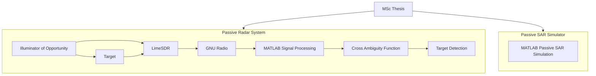

# Passive SAR & Passive Radar System using SDR

## Overview

This repository contains the work developed during my **MSc Thesis in Naval Engineering – Weapons & Electronics**.

The project focuses on the development and evaluation of a **Passive Radar** and **Passive Synthetic Aperture Radar (Passive SAR)** system using **Software Defined Radio (SDR)** technology.

The implementation combines **MATLAB**, **GNU Radio** and **LimeSDR** to perform passive signal acquisition, signal processing, target detection and SAR simulation using illuminators of opportunity.

---

## Objectives

| Objective | Description |
|-----------|-------------|
| Passive Radar | Develop a passive radar processing chain |
| Passive SAR | Implement a Passive Synthetic Aperture Radar simulator |
| SDR Integration | Integrate LimeSDR with GNU Radio |
| Signal Processing | Implement radar signal processing algorithms |
| Target Detection | Detect airborne targets using illuminators of opportunity |
| MATLAB Development | Develop signal processing algorithms in MATLAB |
| Experimental Validation | Evaluate the proposed system using SDR hardware |

---

## System Architecture

The MSc thesis consists of two independent developments:

- **Passive Radar System** using SDR hardware for real-time signal acquisition and target detection.
- **Passive SAR Simulator** developed in MATLAB for Synthetic Aperture Radar signal processing and simulation.

Although both projects were developed within the same research work, they are independent implementations.



---

## Technologies

| Technology | Purpose |
|-----------|---------|
| MATLAB | Signal processing and SAR simulation |
| GNU Radio | SDR signal acquisition |
| LimeSDR | RF front-end |
| Software Defined Radio | Passive radar receiver |
| Digital Signal Processing | Detection algorithms |
| Passive Radar | Aircraft detection |
| Passive SAR | Synthetic aperture simulation |

---

## Repository Structure

```text
SAR-Passive-Radar-LimeSDR-Simulator/
│
├── GNU RADIO/
│   ├── SDR acquisition flowgraphs
│   └── LimeSDR configuration
│
├── MATLAB/
│   ├── Passive SAR simulation
│   ├── Cross Ambiguity Function
│   ├── Signal processing algorithms
│   ├── Detection routines
│   └── Visualization scripts
│
├── LITERATURE/
│   ├── Research papers
│   ├── References
│   └── Supporting documentation
│
└── README.md
```

---

## Processing Pipeline

The implemented passive radar processing chain consists of the following stages.

| Stage | Description |
|--------|-------------|
| Signal Acquisition | RF acquisition using LimeSDR |
| Channel Separation | Reference and surveillance channel extraction |
| Synchronization | Time alignment |
| Cross Correlation | Signal correlation |
| Cross Ambiguity Function | Range-Doppler processing |
| Target Detection | Detection of moving targets |
| Passive SAR | SAR image simulation |

---

## Hardware

| Component | Description |
|-----------|-------------|
| SDR | LimeSDR |
| SDR Software | GNU Radio |
| Processing Platform | MATLAB |
| Operating System | Windows |

---

## Setup

### Requirements

| Software | Version |
|----------|---------|
| MATLAB | Recommended latest release |
| GNU Radio | Compatible version |
| LimeSDR Drivers | Installed |
| LimeSuite | Installed |

---

### Execution Workflow

1. Configure the LimeSDR device.
2. Execute the GNU Radio acquisition flowgraph.
3. Record reference and surveillance channels.
4. Import the captured data into MATLAB.
5. Execute the signal processing scripts.
6. Analyse the generated Cross Ambiguity Function.
7. Perform Passive SAR simulation.

---

## Project Demonstration

A demonstration of the developed system is available below.

📺 **YouTube**

https://www.youtube.com/watch?v=VWCTOe3eWyw

---

## MSc Thesis

The complete dissertation is publicly available.

📖 **Repository**

https://comum.rcaap.pt/entities/publication/41b95197-6db2-41c5-8779-68fad87be082

---

## Results

The developed system successfully demonstrates:

| Result | Status |
|---------|--------|
| SDR Acquisition | ✅ Completed |
| MATLAB Processing | ✅ Completed |
| Cross Ambiguity Function | ✅ Implemented |
| Passive Radar Detection | ✅ Validated |
| Passive SAR Simulation | ✅ Implemented |
| Experimental SDR Tests | ✅ Completed |

---


## References

The project is based on concepts from:

- Passive Radar
- Passive Synthetic Aperture Radar
- Software Defined Radio
- Digital Signal Processing
- Radar Signal Processing
