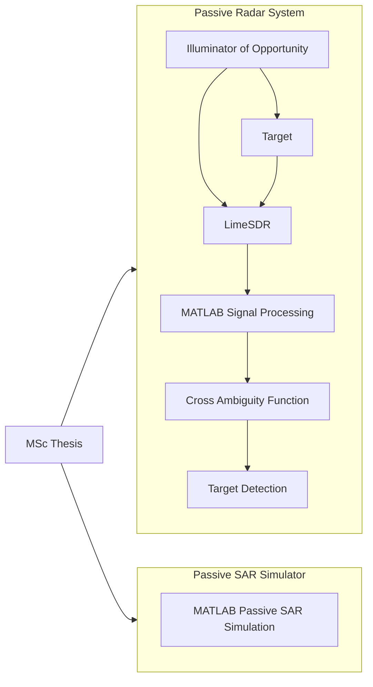
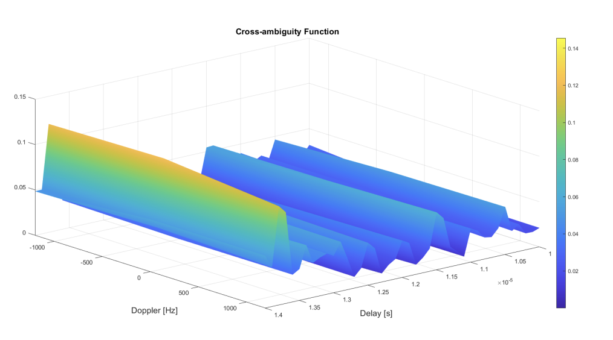
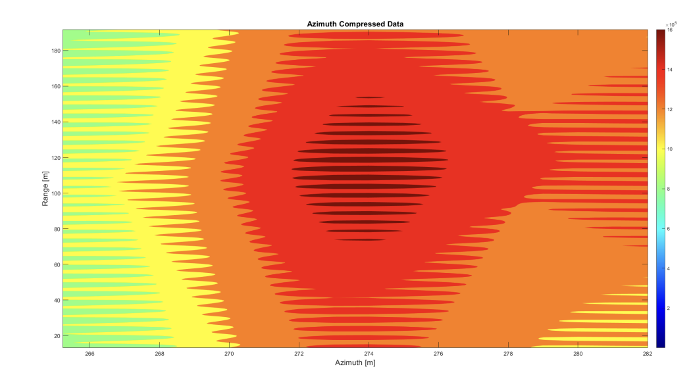
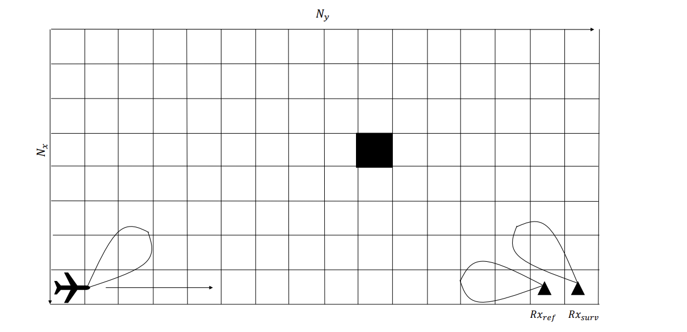

# Passive SAR & Passive Radar System using SDR

## Overview

The project combines two complementary research components developed during my MSc thesis:

- A real Passive Radar implementation using LimeSDR and GNU Radio for signal acquisition and aircraft detection experiments.
- A MATLAB-based Passive SAR simulator developed to study bistatic synthetic aperture radar signal processing and image formation.

Together, these components demonstrate the complete development cycle of an SDR-based passive radar system, from real signal acquisition to advanced MATLAB signal processing, alongside an independent Passive SAR simulation framework.

---

## System Architecture

The MSc thesis consists of two independent developments:

- **Passive Radar System** using SDR hardware for real-time signal acquisition and target detection.
- **Passive SAR Simulator** developed in MATLAB for Synthetic Aperture Radar simulation.

Although both projects were developed within the same research work, they are independent implementations.



---

## Objectives

| Objective | Description |
|-----------|-------------|
| Passive Radar | Develop a passive radar processing chain |
| Passive SAR | Implement a Passive Synthetic Aperture Radar simulator |
| SDR Integration | Integrate LimeSDR with GNU Radio |
| Signal Processing | Implement radar signal processing algorithms |
| Target Detection | Detect airborne targets using illuminators of opportunity |
| Experimental Validation | Evaluate the proposed system using SDR hardware |

---


## Technologies

| Technology | Purpose |
|-----------|---------|
| MATLAB | Signal processing and SAR simulation |
| GNU Radio | SDR signal acquisition |
| LimeSDR | RF front-end |
| Software Defined Radio | RF Signal acquisition |
| Digital Signal Processing | Detection algorithms |
| Passive Radar | Target detection algorithms |
| Passive SAR | Synthetic aperture simulation |

---

## Repository Structure

```text
SAR-Passive-Radar-LimeSDR-Simulator/
│
├── README.md
│
├── images/
│   └── Figures used in the project documentation.
│
├── GNU RADIO/
│   └── GNU Radio Companion flowgraphs for SDR signal acquisition,
│       receiver experiments and passive radar implementations.
│
├── MATLAB/
│   │
│   ├── Library/
│   │   └── Documentation
│   │
│   ├── Main program/
│   │   └── Main SDR acquisition and signal processing scripts used for
│   │       passive radar experiments.
│   │
│   └── Passive Radar Simulator/
│       └── MATLAB simulation models for Passive SAR and
│           passive radar signal processing.
│
└── LITERATURE/
    └── Research papers, technical references and supporting material.
```
---

## Processing Pipeline

### Passive Radar Processing

| Stage | Description |
|--------|-------------|
| Signal Acquisition | RF signal acquisition using LimeSDR |
| Channel Separation | Extraction of reference and surveillance channels |
| Synchronization | Time alignment between received signals |
| Cross Correlation | Correlation between reference and surveillance channels |
| Cross Ambiguity Function (CAF) | Range-Doppler processing |
| Target Detection | Detection of moving targets using illuminators of opportunity |

---

### Passive SAR Processing

| Stage | Description |
|--------|-------------|
| Scene Definition | Definition of the bistatic Passive SAR scenario |
| Signal Simulation | Generation of Passive SAR signals |
| Range Compression | Pulse compression processing |
| Azimuth Compression | Synthetic aperture processing |
| Image Formation | Generation of the final Passive SAR image |

---

## Hardware

| Component | Description |
|-----------|-------------|
| SDR | LimeSDR |
| SDR Software | GNU Radio |
| Processing Platform | MATLAB |
| Operating System | Windows |

---

## Setup

### Requirements

| Software | Version |
|----------|---------|
| MATLAB | Recommended latest release |
| GNU Radio | Compatible version |
| LimeSDR Drivers | Installed |
| LimeSuite | Installed |

---

### Execution Workflow

1. Configure the LimeSDR device.
2. Execute the LimeSDR acquisition flowgraph.
3. Record reference and surveillance channels.
4. Import the captured data into MATLAB.
5. Execute the signal processing scripts.
6. Analyse the generated Cross Ambiguity Function.
7. Perform Passive SAR simulation.

---

## Project Demonstration

A demonstration of the developed system is available below.

📺 **YouTube**

https://www.youtube.com/watch?v=VWCTOe3eWyw

---

## MSc Thesis

The complete dissertation is publicly available.

📖 **Repository**

https://comum.rcaap.pt/entities/publication/41b95197-6db2-41c5-8779-68fad87be082

---

## Results

The project successfully demonstrated both experimental and simulation-based radar processing.

The Passive Radar implementation was validated using real SDR hardware, while the Passive SAR component demonstrated bistatic SAR image formation through MATLAB simulations.

| Result | Status |
|---------|--------|
| SDR Acquisition | ✅ Completed |
| MATLAB Processing | ✅ Completed |
| Cross Ambiguity Function | ✅ Implemented |
| Passive Radar Detection | ✅ Validated |
| Passive SAR Simulation | ✅ Implemented |
| Experimental SDR Tests | ✅ Completed |

The following figures illustrate representative outputs obtained during the development and validation of the passive radar signal processing chain and Passive SAR simulation.

| Cross Ambiguity Function - Passive Radar System | Passive SAR Simulation |
|--------------------------|------------------------|
|  |  |

| Passive SAR Simulation Geometry |
|------------------------|
|  |

---

## Key Contributions

- Development of an SDR-based Passive Radar system using LimeSDR and GNU Radio.
- MATLAB implementation of radar signal processing algorithms.
- Cross Ambiguity Function (CAF) implementation for target detection.
- Passive SAR simulation framework for bistatic imaging.
- Experimental validation using real SDR hardware.

## References

The project is based on concepts from:

- Passive Radar
- Passive Synthetic Aperture Radar
- Software Defined Radio
- Digital Signal Processing
- Radar Signal Processing
